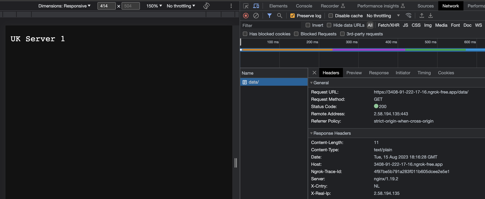
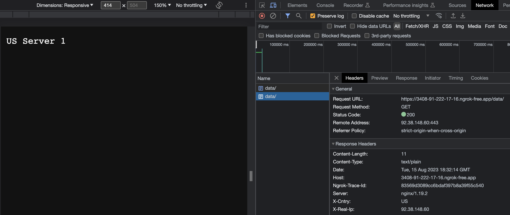
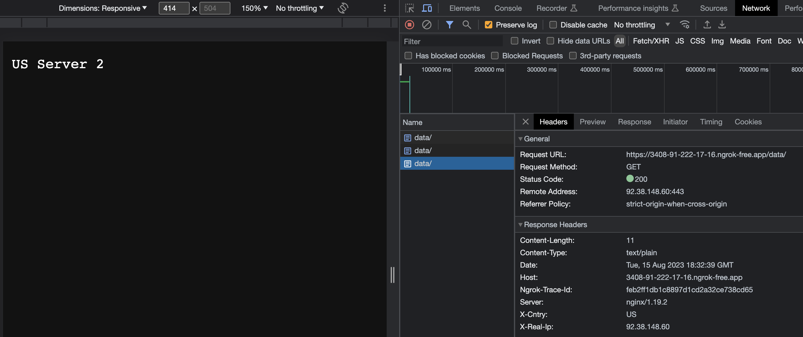
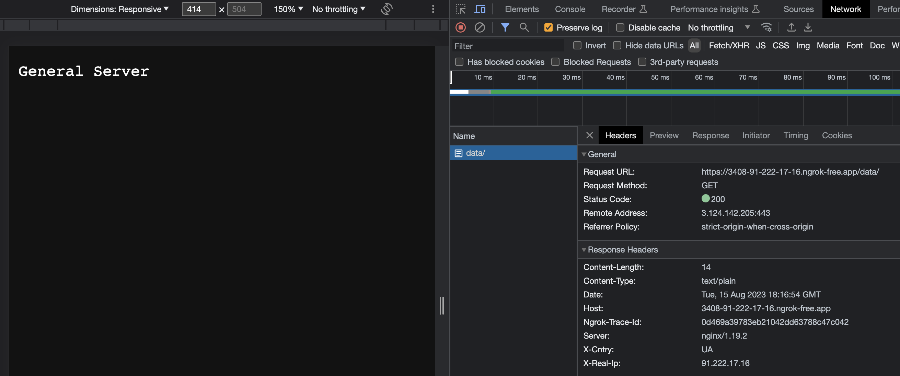
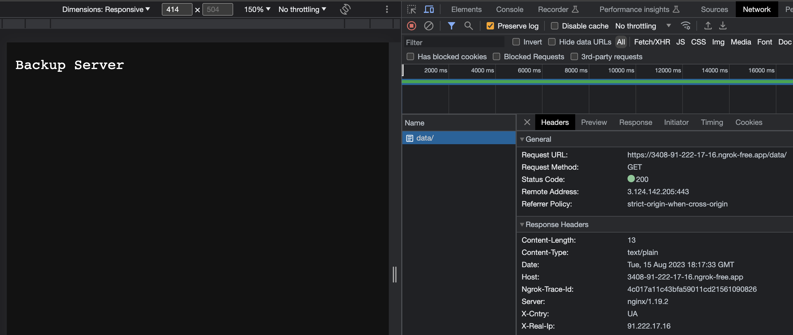

# projector-load-balancing

Balances traffic between servers based on IP address

**NOTES: In order to test the flow, ngrok and TouchVPN Chrome extension is used. 
Sometimes TouchVPN connects to wrong country (e.g. if US was chosen, it can connect to CA, or
if UK is used, it connects to NL, GB, etc.), therefore load balancer configured in a such way:
for US and CA traffic is routed to US servers, for UK, NL, GB traffic is routed to UK server**

# Run
1. Start up docker containers:
```shell
docker-compose up -d
```
2. Run ngrok:
```shell
ngrok http 80
```
3. Open Chrome TouchVPN and choose location
4. In browser go to `<ngrok url>/data/`
5. Each server returns plain text with it`s name: US Server 1, US Server 2, UK Server 1, General Server, Backup Server. 

# Tests
1. UK Server

2. US Server 1

2. US Server 2

3. General Server: disable vpn, go to the link: `<ngrok url>/data/`

4. Backup Server: stop general server, go to the link: `<ngrok url>/data/`

